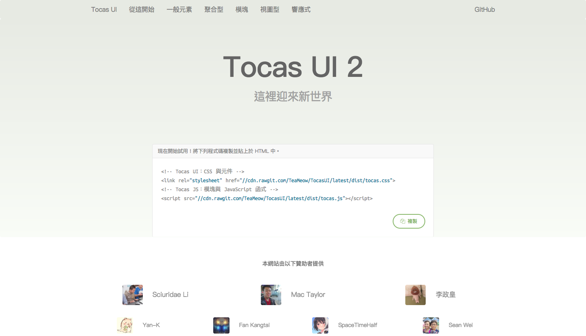

# Docs

這是 Tocas UI 的[官方教學文件](https://tocas-ui.com/)原始碼。



## 使用技術

* Vue.js（Vuex）
* Sass（CSS Module）
* Pug（Jade）
* JavaScript（ES6）

## 開始編輯

透過下列指令安裝必須套件。

```bash
$ npm install
```

接著啟動測試熱重載伺服器。

```bash
$ npm run dev

> tocasui-docs@2.3.1 dev /Users/YamiOdymel/Docs
> node build/server.js

【正位於 http://localhost:8080 監聽中】
```

接著參訪 `http://localhost:8080` 即可直接開啟本地教學文件頁面。

## 結構

```js
Docs
├── build                // 工作區域設置
├── client
│  ├── assets            // 靜態圖片、樣式
│  ├── components        // 重複性元件
│  ├── docs              // 文件內容
│  ├── styles            // 部分文件樣式
│  └── views             // 頁面元件
└── images               // 網站圖示、螢幕截圖
```

## 文件格式

每單個元件的文件皆由 `.yml` 格式作為基礎。

```yml
slate:
  title      : 按鈕
  description: 一個重要的按鈕，我們將它視為核彈按鈕般，精心設計和呵護。

intro: |
  <p>按鈕具有多種樣式和語意，請注意的是，語意和顏色不同，請不要為了要新增紅色按鈕，就建立一個「負面」按鈕。</p>
  <p>請務必遵循 CSS 樣式中的含意。</p>

styles:
  - category   : 種類
    description: 一個按鈕具有多個不同的種類。
    items      :
      - title      : 按鈕
        description: 一個正常的按鈕。
        code       : |
          <button class="ts [[button]]">按鈕</button>
```

### 特殊格式

在 Tocas UI 中有三個特殊標記：

* `[[文字]]`：這會用來凸顯包覆的文字，很常用在需要特別標記重要樣式名稱（Class）的時候。
* `{{文字}}`：自動將包覆的文字轉換成相關連結，如 `{{segment}}` 將會被轉換成 `<a href="//tocas-ui.com/elements/segment">segment</a>`，這很常用在希望能將樣式名稱中的某元素加上相關連結時候。
* `!-文字-!`：這會將文字轉換成圖片，可用關鍵字有：`16:9`、`1:1`、`4:3`、`user`、`user2`、`user3`。

具體範例如下：

```yml
- title      : 按鈕
  description: 一個正常的按鈕。
  code       : |
      <button class="ts icon [[button]]">
          <i class="heart {{icon}}"></i>
      </button>
      
```