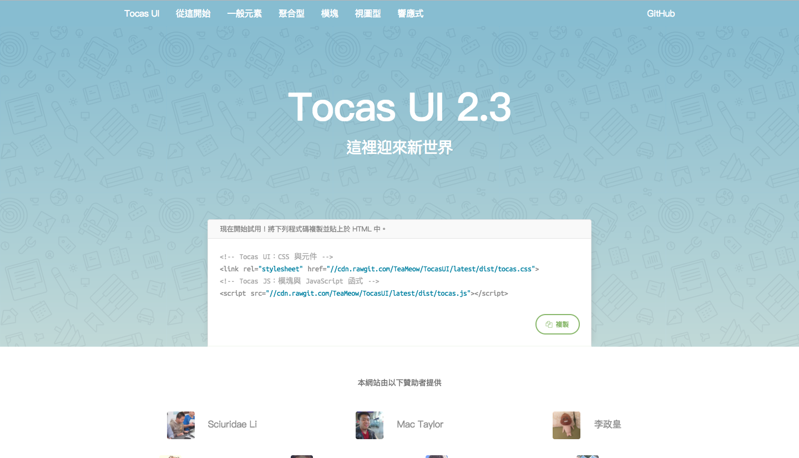

# Docs

這是 Tocas UI 的[官方教學文件](https://tocas-ui.com/)原始碼。



## 使用技術

* Vue.js（Vuex）
* Sass（CSS Module）
* Pug（Jade）
* JavaScript（ES6）

## 開始編輯

透過下列指令安裝必須套件。

```bash
$ npm install
```

接著啟動測試熱重載伺服器。

```bash
$ npm run dev

> tocasui-docs@2.3.0 dev /Users/YamiOdymel/Docs
> node build/server.js

【正位於 http://localhost:8080 監聽中】
```

接著參訪 `http://localhost:8080` 即可直接開啟本地教學文件頁面。